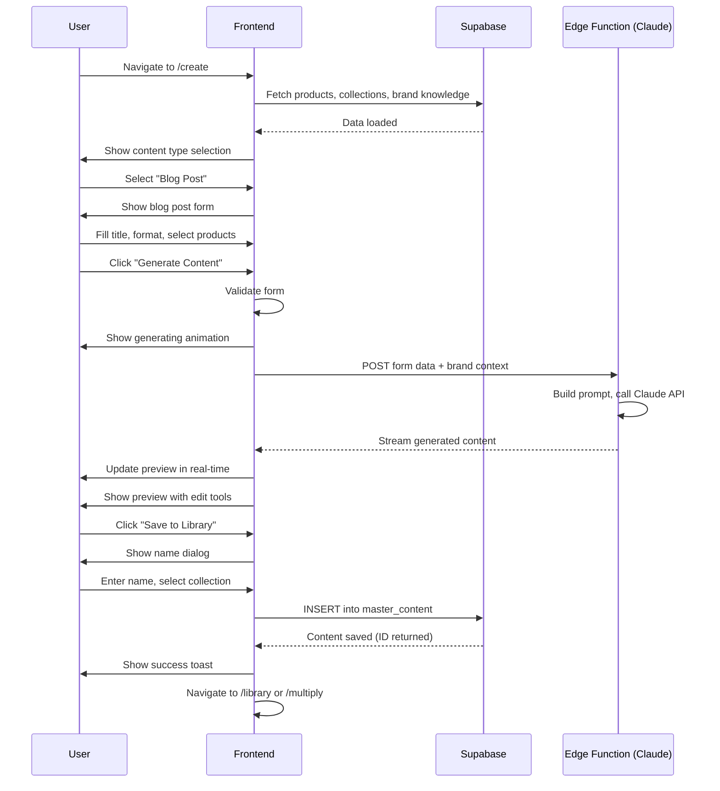

# Workflow 02: Content Creation Flow (The Forge)

## Overview & Purpose

The Content Creation Flow (internally called "The Forge") is where users generate AI-powered master content pieces. This workflow supports multiple content types (blog posts, emails, product stories, visual assets) and leverages brand knowledge to produce on-brand content.

**Primary Goals**:
- Select content type and format
- Provide content inputs (topic, product, key points)
- Generate AI content using Claude
- Preview and edit generated content
- Save to library or multiply into derivatives

---

## Entry Points

1. **Dashboard "Create Content" CTA** - Large button in hero section
2. **Sidebar Navigation** - "Create" menu item with pen icon
3. **Empty Library State** - "Create your first content" button
4. **Quick Actions** - From onboarding success screen
5. **Madison Assistant** - Suggested action in chat

---

## Step-by-Step Screens

### Screen 1: Content Type Selection

**Layout**:
- Header: "What would you like to create?"
- Grid of content type cards (2x3 on desktop, 1 column on mobile):
  1. **Blog Post** - Book icon, "Long-form articles and stories"
  2. **Email Campaign** - Envelope icon, "Newsletters and promotions"
  3. **Product Story** - Tag icon, "Product descriptions and features"
  4. **Social Media** - Share icon, "Instagram, Twitter, LinkedIn posts"
  5. **Visual Asset** - Image icon, "Graphics and images with AI"
  6. **Custom Prompt** - Wand icon, "Free-form content generation"

**Visual Details**:
- Cards: Bordered, hoverable, icon + title + subtitle
- Hover state: Subtle shadow, scale 1.02
- Selected state: Gold border, background tint
- Icons: Lucide React icons, 32px, primary color

**User Action**:
- Click card → Navigate to form for that type
- Form slides in from right (mobile: full screen)

---

### Screen 2A: Blog Post Form

**Layout**:
- Back button (top left): "← Content Types"
- Heading: "Create Blog Post"
- Form fields (vertical stack):
  1. **Title** (text input, required)
     - Placeholder: "Enter your blog post title..."
  2. **Format** (select dropdown)
     - Options: How-To Guide, Listicle, Thought Leadership, Product Review, Storytelling
  3. **Target Word Count** (number input)
     - Default: 800 words
  4. **Product Selection** (optional, multi-select)
     - Searchable dropdown from brand_products table
  5. **Key Points** (textarea, optional)
     - Placeholder: "Main ideas or themes to cover..."
  6. **Tone** (select)
     - Options: Professional, Conversational, Playful, Educational
- Bottom action bar:
  - "Generate Content" (primary button, large)
  - "Save as Draft" (secondary, text link)

**Validation**:
- Title: Required, min 10 characters
- Format: Required
- Word count: 200-3000 range

---

### Screen 2B: Email Campaign Form

**Layout**: Similar to blog post, with different fields:
1. **Subject Line** (text input, required)
2. **Email Type** (select)
   - Newsletter, Promotional, Welcome Series, Product Launch
3. **Primary CTA** (text input)
   - "Shop Now", "Learn More", etc.
4. **Product Selection** (optional)
5. **Key Message** (textarea)

---

### Screen 2C: Product Story Form

**Layout**:
1. **Select Product** (required, single select from catalog)
   - Shows product name, image thumbnail, category
2. **Story Angle** (select)
   - Origin Story, Benefits Focus, Ingredients Deep-Dive, Usage Guide
3. **Target Length** (select)
   - Short (100-200 words), Medium (200-400), Long (400-600)
4. **Include Product Details** (checkboxes)
   - Notes, Ingredients, Usage, Benefits

---

### Screen 2D: Visual Asset Form

**Layout**:
1. **Asset Type** (select)
   - Product Photo, Lifestyle Image, Graphic, Illustration
2. **Description** (textarea, required)
   - "Describe what you want to see..."
3. **Aspect Ratio** (radio buttons)
   - Square (1:1), Portrait (4:5), Landscape (16:9)
4. **Product to Feature** (optional, single select)
5. **Style Reference** (optional upload or text)

---

### Screen 3: Generating State

**Layout**:
- Center: Large animated loader
  - Madison logo or pen icon rotating/pulsing
  - "Generating your content..." text
  - Progress indicator or animated dots
- Background: Slightly dimmed main form
- Optional: Tips carousel
  - "Madison is analyzing your brand voice..."
  - "Crafting on-brand messaging..."
  - "Almost ready..."

**Visual Details**:
- Loader: Gold/brass color, smooth animation
- Text: Cormorant font, elegant
- Duration: Typically 5-15 seconds
- No dismiss button (process must complete)

**States**:
- Sending request: "Preparing your request..."
- Processing: "Madison is writing..." (for text) or "Generating image..." (for visual)
- Finalizing: "Polishing the details..."

---

### Screen 4: Content Preview & Edit

**Layout**:
- Split view (desktop) or tabs (mobile):
  - **Left**: Original form (collapsible/minimizable)
  - **Right**: Generated content preview
- Preview pane:
  - Content rendered in reading format
  - **For text**: Typography styling, paragraph breaks
  - **For images**: Large preview with download button
- Editing tools:
  - **Text content**: Rich text editor (limited formatting)
  - **Regenerate section**: Highlight text, click "Rewrite this"
  - **Adjust tone**: Slider or buttons (More formal ↔ More casual)
- Bottom action bar:
  - "Save to Library" (primary)
  - "Multiply" (secondary, accent color)
  - "Regenerate All" (tertiary)
  - "Discard" (text link, destructive)

**Visual Details**:
- Preview pane: Clean, readable, white background
- Editor: Inline editing, highlights on hover
- Save button: Large, prominent, gold color
- Multiply button: Slightly smaller, teal/blue accent

---

### Screen 5: Save Confirmation / Name Content Dialog

**Layout** (Modal overlay):
- Title: "Save Your Content"
- Form:
  1. **Content Name** (text input, pre-filled with generated title)
  2. **Collection** (select dropdown)
     - From brand_collections table
     - Option to create new collection inline
  3. **Tags** (multi-select or tag input)
     - Auto-suggested based on content
- Actions:
  - "Save" (primary)
  - "Cancel" (secondary)

**After Save**:
- Toast notification: "Content saved to Library"
- Options in toast:
  - "View in Library" (link)
  - "Multiply" (button)
  - "Schedule" (button)

---

## UI Components Breakdown

### Content Type Cards
- **Component**: Custom grid of clickable cards
- **Structure**:
  ```jsx
  <div className="grid md:grid-cols-2 lg:grid-cols-3 gap-4">
    <Card onClick={selectType}>
      <Icon /> {/* Lucide icon */}
      <h3>{title}</h3>
      <p>{description}</p>
    </Card>
  </div>
  ```
- **Styling**: `border hover:shadow-md hover:scale-102 transition-all cursor-pointer`

### Form Fields
- **Text Input**: Standard `Input` component with validation
- **Select Dropdown**: `Select` component with searchable options
- **Textarea**: `Textarea` component with character count
- **Product Selector**: Custom multi-select with product images

### Loading Animation
- **Component**: `ScriptoraLoadingAnimation` or `GeneratingLoader`
- **Features**:
  - CSS/Framer Motion animation
  - Rotating pen nib icon
  - Pulsing text
  - Progress dots

### Content Editor
- **Component**: `ContentEditor` (custom rich text)
- **Features**:
  - Inline editing
  - Section regeneration
  - Tone adjustment slider
  - Word count display

### Name Content Dialog
- **Component**: `NameContentDialog`
- **Features**:
  - Modal overlay
  - Form with validation
  - Collection management (create inline)
  - Tag input with suggestions

---

## State Management

### Local Form State
```typescript
const [selectedType, setSelectedType] = useState<ContentType | null>(null)
const [formData, setFormData] = useState({
  title: '',
  format: '',
  wordCount: 800,
  products: [],
  keyPoints: '',
  tone: 'professional'
})
const [isGenerating, setIsGenerating] = useState(false)
const [generatedContent, setGeneratedContent] = useState('')
```

### Edge Function Call
- **Function**: `generate-with-claude`
- **Inputs**: Form data + brand knowledge context
- **Outputs**: Generated content (text or image URL)
- **Error handling**: Show error toast, allow retry

### Database Save
- **Table**: `master_content`
- **Fields**:
  - `title`, `content_type`, `full_content`
  - `organization_id`, `created_by`
  - `collection`, `word_count`, `quality_rating`
  - `status: 'draft'`

---

## User Actions & Transitions

### Content Type Selection → Form
- Click card → `setSelectedType(type)`
- Slide in form from right
- Load product catalog if needed

### Form Submission → Generating
- Click "Generate" → Validate form
- Show loading animation
- Call edge function with form data + brand context
- Stream response (for text) or poll (for images)

### Generating → Preview
- Content received → Hide loader
- Render content in preview pane
- Enable editing tools
- Auto-save to localStorage (draft)

### Preview → Save
- Click "Save to Library" → Open name dialog
- Fill name/collection → Insert to master_content table
- Show success toast with actions
- Navigate to library or stay in editor

### Preview → Multiply
- Click "Multiply" → Save content first (if not saved)
- Navigate to `/multiply` with master content ID
- Multiply page loads with this content pre-selected

---

## Responsive Behaviors

### Desktop (> 1024px)
- Type cards: 3-column grid
- Form: Left sidebar (400px), preview right (fluid)
- Editor: Split view, both panels visible
- Action bar: Fixed bottom, centered buttons

### Tablet (768px - 1024px)
- Type cards: 2-column grid
- Form: Slides over preview (tabs or overlay)
- Editor: Single panel, toggle between edit/preview

### Mobile (< 768px)
- Type cards: Single column stack
- Form: Full screen, back button to types
- Preview: Full screen, bottom sheet for actions
- Editor: Mobile-optimized (limited rich text tools)
- Action bar: Sticky bottom, full-width buttons

---

## Integration Points

### ← Brand Knowledge (from Settings)
- Loaded on page mount
- Injected into AI prompt context
- Influences tone, style, vocabulary

### ← Products Catalog (from Settings)
- Fetched from `brand_products` table
- Displayed in searchable dropdown
- Product details included in generation prompt

### → Library
- After save, content appears in library
- Filterable by content type
- Editable from library detail view

### → Multiply
- "Multiply" button passes master content ID
- Multiply page pre-loads master content
- User selects derivative types to generate

### ↔ Madison Assistant
- Madison can suggest content ideas
- Can trigger content creation flow
- Can review generated content and suggest improvements

---

## Data Flow Diagram



---

## Design Tokens Reference

### Colors
- Background: `hsl(var(--background))`
- Form fields: `bg-background border-border`
- Primary button: `bg-primary text-primary-foreground`
- Accent (Multiply): `bg-accent text-accent-foreground`
- Preview pane: `bg-card border-border`

### Typography
- Headings: `font-cormorant text-3xl font-bold`
- Form labels: `font-lato text-sm font-medium`
- Preview text: `font-lato text-base leading-relaxed`
- Placeholder: `text-muted-foreground`

### Spacing
- Form padding: `p-6`
- Field gap: `space-y-4`
- Card gap: `gap-4`
- Preview padding: `p-8`

### Borders
- Cards: `border border-border rounded-lg`
- Inputs: `border-border focus:border-primary`
- Preview: `border-l border-border` (split view divider)

### Shadows
- Type cards: `hover:shadow-lg transition-shadow duration-300`
- Modal: `shadow-2xl`
- Preview: `shadow-sm`

---

## Component Inventory

### From Codebase
1. `BlogPostForm` - Blog-specific form fields
2. `ProductSelector` - Searchable product multi-select
3. `ContentOutput` - Preview pane with editing
4. `GeneratingLoader` - Loading animation
5. `ScriptoraLoadingAnimation` - Alternative loader
6. `NameContentDialog` - Save modal
7. `MasterContentForm` - Wrapper for all content forms
8. `VisualAssetForm` - Image generation form
9. `Input`, `Select`, `Textarea`, `Button` - Base UI components

### Custom Components Needed
- Tone adjustment slider
- Section regeneration highlight tool
- Real-time content streaming renderer
- Word count indicator
- Auto-save draft indicator

---

## Known Edge Cases

1. **Generation fails**: Show error, allow retry with same inputs
2. **User closes tab during generation**: Draft saved in localStorage, recoverable
3. **No products in catalog**: Product selector shows "Add products in Settings"
4. **Brand knowledge not uploaded**: Generation still works but may be less on-brand
5. **Network timeout**: Show "Taking longer than expected" message, keep polling
6. **User edits while generating**: Queue edits, apply after generation complete
7. **Multiply clicked without saving**: Auto-trigger save dialog first
