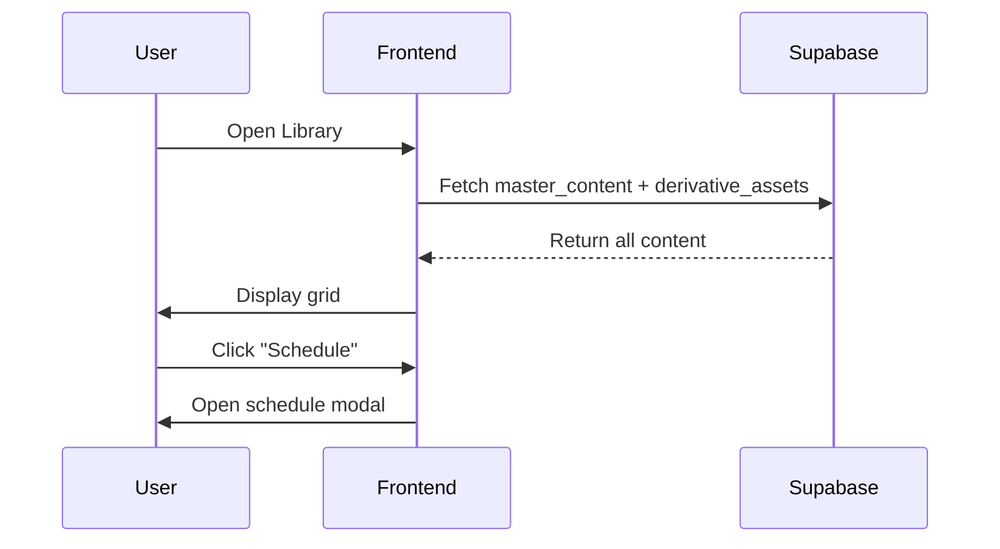

# Workflow 04: Library/Archives Flow

## Overview & Purpose

The Library is the central repository for all content (master and derivatives). Users can browse, search, filter, view details, schedule, and manage their content archive.

**Primary Goals**:
- Browse all content (master and derivatives)
- Search and filter by type, date, collection
- View content details
- Schedule content for publication
- Archive/delete content
- Export content

---

## Entry Points

1. **Sidebar Navigation** - "Library" menu item
2. **After Content Save** - Auto-navigate to library
3. **Dashboard** - "View Library" quick action

---

## Key Screens

### Main Library View
- **Header**: Search bar + filters (type, collection, date range)
- **View toggles**: Grid vs List, Density selector
- **Content grid/list**: Cards showing title, type badge, preview, date, actions
- **Date grouping**: "Today", "This Week", "This Month", "Older"
- **Empty state**: "No content yet. Create your first piece."

### Content Detail Modal
- **Layout**: Full-screen modal with content preview
- **Sections**: Title, full content, metadata (word count, created date, collection)
- **Actions**: Edit, Schedule, Multiply, Archive, Delete, Export (PDF, DOCX, Copy)

### Filters Sidebar
- Content type checkboxes (Blog, Email, Social, etc.)
- Collection dropdown
- Date range picker
- Quality rating filter
- Status filter (Draft, Published, Scheduled)

---

## Components

- `ContentGrid` - Main grid layout
- `ContentCard` - Individual content cards
- `ContentDetailModal` - Detail view modal
- `LibraryFilters` - Filter sidebar
- `SortDropdown` - Sort options
- `ViewDensityToggle` - Grid density control
- `ScheduleButton` - Schedule action

---

## Data Flow

---

## Design Tokens

- Grid gap: `gap-6`
- Card padding: `p-4`
- Hover: `hover:shadow-lg`
- Active filters: `bg-primary/10 border-primary`
