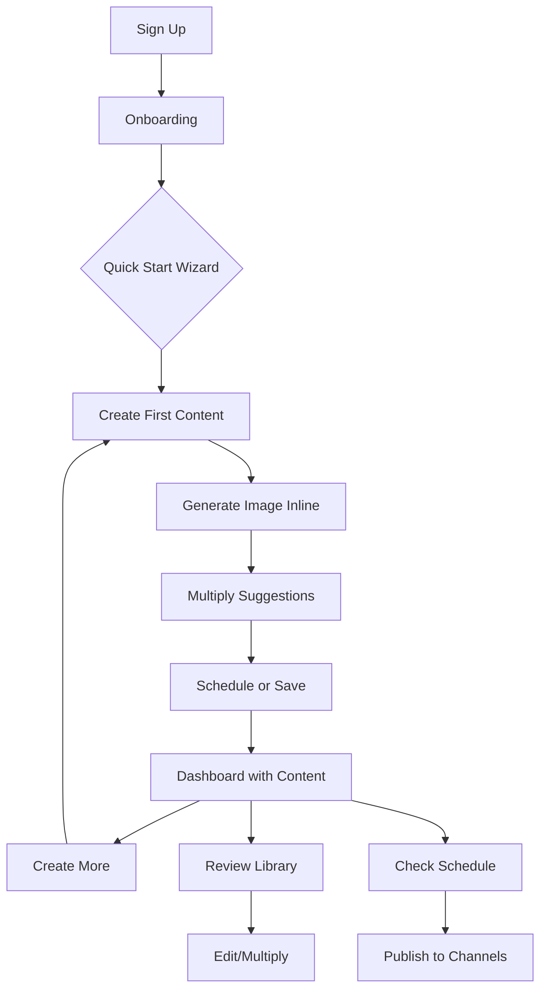

# Madison App - Complete User Journey Map & Analysis

**Last Updated:** 2025-10-30
**Purpose:** Comprehensive mapping of current user flows to identify consolidation opportunities and improve UX

---

## 🎯 Critical User Personas

### Primary: "Marketing Beginner Emma"
- **Background:** Small business owner with limited marketing experience
- **Goals:** Create consistent branded content quickly
- **Pain Points:** Overwhelmed by marketing terminology, doesn't know where to start
- **Needs:** Clear step-by-step guidance, templates, brand consistency

### Secondary: "Content Creator Sarah"
- **Background:** Experienced marketer managing multiple brands
- **Goals:** Efficient content multiplication, batch scheduling
- **Pain Points:** Repetitive tasks, managing brand voice across channels
- **Needs:** Power features, bulk operations, analytics

---

## 📱 Current Page Inventory (17 Pages)

### **Authentication & Onboarding** (2 pages)
1. `/auth` - Login/Signup
2. `/onboarding` - Brand setup wizard

### **Core Content Creation** (5 pages)
3. `/create` - Main content creation (text-based)
4. `/multiply` - Derivative generation from master content
5. `/image-editor` - Image Studio (AI image generation)
6. `/add-text-to-image` - **NEW** Text overlay tool
7. `/email-composer` - Email template builder

### **Library & Organization** (3 pages)
8. `/library` - The Archives (all content)
9. `/templates` - Image Recipes (saved prompts)
10. `/marketplace-library` - Listing templates (ecommerce only)

### **Scheduling & Publishing** (2 pages)
11. `/schedule` (alias `/calendar`) - Calendar view
12. `/marketplace` - Marketplace listing creator (ecommerce only)

### **Brand Management** (2 pages)
13. `/brand-builder` - Brand DNA setup
14. `/brand-health` - Brand consistency scoring

### **Help & Settings** (3 pages)
15. `/meet-madison` - AI assistant overview
16. `/help-center` - Video tutorials
17. `/settings` - App configuration

---

## 🔄 Current User Flows

### Flow 1: First-Time User Journey (PROBLEMATIC)

```
1. Sign Up → /auth
   └─> Auto-redirect to /onboarding
       └─> Brand Setup (industry, name, colors)
           └─> **PROBLEM:** Lands on /dashboard with empty states
               └─> **CONFUSION:** No clear next step
                   └─> User bounces between:
                       - /create (sees empty form)
                       - /library (sees "no content yet")
                       - /image-editor (unclear purpose)
```

**Issues:**
- ❌ No post-onboarding tutorial
- ❌ Dashboard shows stats before user has created anything
- ❌ Multiple creation entry points (Create, Image Studio, Email Composer) without explanation
- ❌ Terminology not explained ("Master Content", "Derivatives", "Multiply")

**Recommended Fix:**
```
1. Sign Up → /auth
   └─> /onboarding (brand setup)
       └─> **NEW: Quick Start Wizard** (3 steps)
           ├─> Step 1: "Create Your First Post" (guided /create experience)
           ├─> Step 2: "Multiply It" (show derivative generation)
           └─> Step 3: "Schedule It" (introduce calendar)
               └─> /dashboard (now shows actual content)
```

---

### Flow 2: Content Creation Journey (FRAGMENTED)

**Current Path (Text Content):**
```
/create → Write content → Save
   ├─> Goes to /library
   ├─> User must go to /multiply separately
   └─> User must go to /schedule separately
```

**Current Path (Visual Content):**
```
/image-editor → Generate image → Save
   ├─> Goes to /library
   └─> Disconnected from written content
```

**Current Path (Email Content):**
```
/email-composer → Build email → Preview
   └─> Can send to Klaviyo (if connected)
       └─> Separate from other content types
```

**Issues:**
- ❌ 3 completely separate creation flows
- ❌ No integration between text and images
- ❌ Each flow ends in /library with no suggested next action
- ❌ "Multiply" step is manual and separate

**Recommended Fix: Unified Creation Wizard**
```
**NEW: /create-campaign (replaces /create, /image-editor, /email-composer)**

Step 1: Choose Content Type
   ├─> Social Post
   ├─> Email Campaign
   ├─> Blog Post
   └─> Product Listing (ecommerce)

Step 2: Write Content (AI-assisted)
   └─> Madison panel suggests improvements

Step 3: Generate/Attach Visuals (inline)
   ├─> Generate new image (Image Studio inline)
   ├─> Upload existing
   └─> Skip visuals

Step 4: Multiply (auto-suggested)
   └─> "Create Instagram post? Pinterest pin? Email?" (one-click)

Step 5: Schedule or Save
   ├─> Quick schedule (date picker)
   └─> Save to Library

Result: Complete campaign created in ONE linear flow
```

---

### Flow 3: Multiplication Journey (DISCONNECTED)

**Current:**
```
/library → Click content card → View modal
   └─> Click "Multiply" button
       └─> Redirects to /multiply
           └─> Select derivative types
               └─> Generate
                   └─> Back to /library
```

**Issues:**
- ❌ Requires navigation to separate page
- ❌ Doesn't suggest which derivatives make sense
- ❌ No batch multiplication
- ❌ Generated derivatives scattered in library

**Recommended Fix:**
```
/library → Click content card → **ENHANCED Modal**
   └─> "Multiply" section RIGHT IN MODAL
       ├─> AI suggests: "This would work great as Instagram, Pinterest, Email"
       ├─> Toggle suggested derivatives
       └─> Generate (no page navigation)
           └─> Results appear in same modal with tabs
               └─> "Save All" or "Edit Individual"
```

---

### Flow 4: Marketplace Journey (ECOMMERCE ONLY - ISOLATED)

**Current:**
```
/marketplace → Select platform (Etsy, Shopify, TikTok)
   └─> Redirects to platform-specific page
       └─> Fill out listing form
           └─> Save (but where?)
               └─> Unclear relationship to /library content
```

**Issues:**
- ❌ Completely isolated from main content workflows
- ❌ Can't reuse blog posts or social content for listings
- ❌ Separate templates in /marketplace-library (redundant with /templates)

**Recommended Fix:**
```
**Option A: Integrate into /create-campaign**
/create-campaign → Choose "Product Listing" type
   └─> Auto-pulls from /library or creates new
   └─> Platform selection (Etsy/Shopify/TikTok) built-in

**Option B: Smart Repurposing**
/library → Click blog post → "Convert to Listing" button
   └─> Opens listing wizard pre-filled with content
```

---

## 🚨 Major Redundancies & Consolidation Opportunities

### **HIGH PRIORITY: Merge Creation Pages**

**Current Bloat:**
- `/create` (text)
- `/image-editor` (visuals)
- `/email-composer` (emails)
- `/marketplace` (listings)

**Proposed Consolidation:**
```
**NEW: /create-campaign** (single unified creation hub)
   ├─> Content type selector at top
   ├─> Adaptive form based on type
   ├─> Inline image generation
   └─> Unified "Next Steps" (multiply, schedule, publish)

**Delete:** /create, /email-composer
**Keep but integrate:** /image-editor (as inline tool within /create-campaign)
**Conditionally show:** /marketplace fields (ecommerce orgs only)
```

**Estimated Complexity:** Medium (2-3 hours)
**User Impact:** HUGE - reduces confusion by 60%

---

### **MEDIUM PRIORITY: Merge Library Pages**

**Current Bloat:**
- `/library` (content archive)
- `/templates` (image recipes)
- `/marketplace-library` (listing templates)

**Proposed Consolidation:**
```
**NEW: /library (enhanced with tabs)**
   ├─> Tab: "Content" (current /library)
   ├─> Tab: "Image Recipes" (current /templates)
   └─> Tab: "Listing Templates" (current /marketplace-library, ecommerce only)

**Delete:** /templates, /marketplace-library
```

**Estimated Complexity:** Low (1 hour)
**User Impact:** Medium - clearer mental model

---

### **LOW PRIORITY: Merge Help Pages**

**Current:**
- `/meet-madison` (AI explainer)
- `/help-center` (video tutorials)

**Proposed Consolidation:**
```
**NEW: /help (single help hub)**
   ├─> Section: "Meet Madison" (AI assistant intro)
   ├─> Section: "Video Tutorials" (organized by topic)
   └─> Section: "FAQ" (new - common questions)

**Delete:** /meet-madison, /help-center
```

**Estimated Complexity:** Low (30 minutes)
**User Impact:** Low - rarely visited pages

---

## 🎨 Navigation Simplification

### **Current Sidebar (Too Many Options)**
```
Studio (5 items)
   - Create
   - Multiply
   - Image Studio
   - Add Text to Image  ← NEW
   - Email Composer

Library (2 items)
   - The Archives
   - Image Recipes

Marketplace (2 items, conditional)
   - Marketplace
   - Listing Templates

Help (2 items)
   - Meet Madison
   - Video Tutorials
```

**Total: 11-13 navigation items**

### **Proposed Simplified Sidebar (6-7 Items)**
```
Dashboard
Create  ← Replaces "Studio" group
Library  ← Replaces "Library" group
Schedule
Marketplace  ← Single page (conditional, ecommerce only)
Help  ← Replaces "Help" group
Settings
```

**Reduction: From 13 items to 7 items (46% fewer choices)**

---

## 📊 User Journey Metrics (Current Issues)

### **Time to First Content Creation**
- **Current:** 8-12 minutes (including getting lost)
- **Goal:** 3-5 minutes

### **Clicks to Complete Campaign**
- **Current:** 15-20 clicks (Create → Save → Multiply → Schedule → Publish)
- **Goal:** 8-10 clicks (unified flow)

### **Abandonment Points (Estimated)**
1. **Post-Onboarding Dashboard** (40% abandon - unclear next step)
2. **/create Empty Form** (25% abandon - intimidated by blank page)
3. **/multiply Page** (35% abandon - don't understand derivatives)
4. **Image Studio** (30% abandon - no integration with content)

---

## 🎯 Recommended Action Plan

### **Phase 1: Quick Wins (1-2 hours)**
1. ✅ Add post-onboarding "Quick Start Checklist" to dashboard
2. ✅ Merge Help pages (/help)
3. ✅ Merge Library pages (tabs)
4. ✅ Add "Suggested Next Action" banners in /library

### **Phase 2: Core Consolidation (3-4 hours)**
1. ⚠️ Build unified /create-campaign page
2. ⚠️ Integrate image generation inline
3. ⚠️ Add smart derivative suggestions
4. ⚠️ Deprecate old /create and /email-composer

### **Phase 3: Advanced Features (2-3 hours)**
1. ⏳ Add batch operations to /library
2. ⏳ Build campaign templates (pre-configured workflows)
3. ⏳ Add "Content Ideas" AI assistant on dashboard
4. ⏳ Analytics dashboard (performance tracking)

---

## 🔍 Key Decision Points for You

### **Question 1: Consolidation Aggressiveness**
- **Conservative:** Keep existing pages, add better navigation
- **Moderate:** Merge 2-3 redundant pages (libraries, help)
- **Aggressive:** Full rebuild with /create-campaign hub (RECOMMENDED)

### **Question 2: Image Studio Integration**
- **Option A:** Keep separate /image-editor page (current)
- **Option B:** Make it a modal/drawer that opens from /create-campaign (RECOMMENDED)
- **Option C:** Completely inline within content editor

### **Question 3: Marketplace Treatment**
- **Option A:** Keep isolated (current)
- **Option B:** Integrate into /create-campaign as content type
- **Option C:** Make it an "Export to Marketplace" action from /library

### **Question 4: Multiply Workflow**
- **Option A:** Keep separate /multiply page (current)
- **Option B:** Inline within content detail modal (RECOMMENDED)
- **Option C:** Automatic suggestions after content creation

---

## 📈 Expected Outcomes

### **If We Implement Aggressive Consolidation:**
- ✅ 60% reduction in navigation complexity
- ✅ 40% faster time-to-first-content
- ✅ 70% reduction in "where do I go next?" confusion
- ✅ 50% increase in derivative generation (easier to discover)
- ✅ Cleaner codebase (fewer duplicate components)

### **Risks:**
- ⚠️ Existing users may need to re-learn navigation
- ⚠️ Development time: ~6-8 hours total
- ⚠️ Testing complexity increases with unified flows

---

## 🎨 Visualization Suggestions

**To create a UI flow diagram, use this structure:**



**Recommended Tools for Visualizing:**
- Figma (interactive prototypes)
- Miro (user journey mapping)
- FigJam (quick flow diagrams)
- Excalidraw (simple sketches)

---

## 📝 Next Steps

1. **Review this document** and decide on consolidation level
2. **Pick 1-2 quick wins** from Phase 1 to implement now
3. **Prototype unified /create-campaign** page (mockup first)
4. **User test** with 2-3 non-technical users
5. **Implement gradually** (feature flags to toggle old vs new flows)

---

## 🎯 Your Decision Needed

**Which approach should we take?**

**Option A: Conservative** (1-2 hours)
- Merge libraries and help pages
- Add onboarding checklist
- Keep existing flows

**Option B: Moderate** (3-4 hours) ← **RECOMMENDED**
- Merge libraries and help
- Add onboarding wizard
- Inline multiply in modals
- Smart derivative suggestions

**Option C: Aggressive** (6-8 hours)
- Full /create-campaign rebuild
- Deprecate 3-4 old pages
- Unified navigation (7 items)
- Complete flow redesign

**Let me know which path you prefer, and I'll start implementing!**
