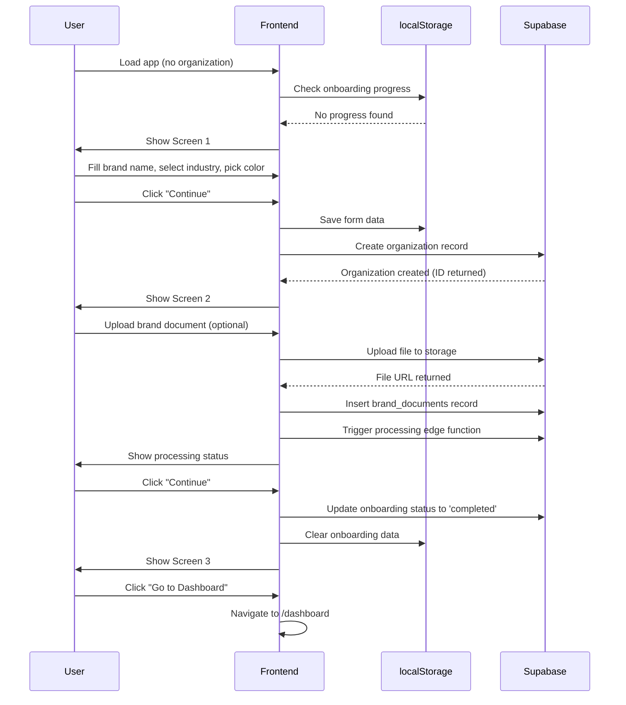

# Workflow 01: Onboarding Flow

## Overview & Purpose

The Onboarding Flow is the first-time user experience that collects essential brand information and sets up the user's organization. It guides new users through defining their brand identity, optionally uploading brand documents, and celebrating their setup completion.

**Primary Goals**:
- Collect brand name and industry
- Set primary brand color
- Optionally upload brand documents for AI training
- Create organization record in database
- Set onboarding completion flag

---

## Entry Points

1. **App Launch** - New user with no organization
2. **Manual Trigger** - `/onboarding` route (if user somehow skipped)
3. **Account Creation** - Immediately after signup/login (no org found)

---

## Step-by-Step Screens

### Screen 1: Welcome & Brand Basics

**Layout**:
- Top: Progress bar (Step 1 of 3)
- Center: Large welcoming headline
- Form fields (vertical stack):
  - Your Name (text input)
  - Brand Name (text input, required)
  - Industry (select dropdown)
  - Primary Color (color picker + hex input)
- Bottom: Two buttons
  - "Continue" (primary, disabled until brand name filled)
  - "I'll do this later" (text link, bottom right)

**Visual Details**:
- Background: Parchment texture
- Headline: Cormorant Garamond, 48px, centered
- Inputs: White background, subtle border, Lato font
- Color picker: Shows current selection with large swatch preview

**Validation**:
- Brand name: Required, min 2 characters
- User name: Auto-saved to localStorage
- Industry: Optional, defaults to blank
- Color: Defaults to `#B8956A` (aged brass)

---

### Screen 2: Brand Document Upload (Optional)

**Layout**:
- Top: Progress bar (Step 2 of 3)
- Center: Upload area
  - Drag-drop zone with icon
  - "Upload Brand Documents" heading
  - Subtitle: "Help Madison learn your brand voice (optional)"
  - File types accepted: PDF, DOCX, TXT
  - Max size: 10MB
- Uploaded files list (appears after upload):
  - File name, size, processing status
  - Remove button for each
- Bottom: Two buttons
  - "Continue" (always enabled)
  - "Skip for now" (secondary)

**Visual Details**:
- Upload zone: Dashed border, hover state changes to solid
- Processing indicator: Spinner + "Processing..." text
- Success state: Green checkmark icon
- Error state: Red alert with message

**States**:
- Empty: Default upload zone
- Uploading: Progress bar per file
- Processing: Spinner icon, "Extracting content..."
- Complete: Checkmark, file preview text snippet
- Error: Alert banner, retry option

---

### Screen 3: Success & Quick Actions

**Layout**:
- Top: No progress bar (completion)
- Center: Success message
  - Large checkmark icon (animated entrance)
  - "You're all set!" headline
  - Subtext: Brief encouragement
- Quick action cards (3 columns):
  1. "Create Your First Content"
  2. "Upload Products"
  3. "Explore Templates"
- Bottom: Large primary button
  - "Go to Dashboard" (or "Start Creating")

**Visual Details**:
- Success icon: Animated scale-in, gold/brass color
- Cards: Hoverable, subtle shadow, icon + text
- Background: Slightly lighter parchment
- Celebration feel: Lighter, more spacious

**User Actions**:
- Click quick action → Navigates to that flow
- Click primary button → Navigates to dashboard
- Modal auto-closes after action selection

---

## UI Components Breakdown

### Progress Bar
- **Component**: `OnboardingProgressBar`
- **Props**: `currentStep`, `totalSteps`
- **Styling**: 
  - Container: `w-full h-2 bg-muted rounded-full`
  - Fill: `bg-primary transition-all duration-300`
  - Width: `${(currentStep / totalSteps) * 100}%`

### Input Fields
- **Component**: Standard `Input` from UI library
- **Variants**: 
  - Text: `placeholder="Enter your brand name"`
  - Select: Industry dropdown with common options
  - Color: Native color input + hex text input synchronized

### Color Picker
- **Component**: Custom color input
- **Features**:
  - Native `<input type="color">` hidden
  - Custom trigger: Large circular swatch
  - Hex input field: Validates format
  - Live preview on change

### Upload Zone
- **Component**: `OnboardingDocumentUpload`
- **Features**:
  - Drag-and-drop listeners
  - File type validation
  - Size limit enforcement
  - Multiple file support
  - File preview list

### Success Modal
- **Component**: `OnboardingCompleteModal`
- **Features**:
  - Animated entrance
  - Quick action cards
  - Confetti animation (optional)
  - Auto-navigate on click

---

## State Management

### Local State (React useState)
```typescript
const [currentStep, setCurrentStep] = useState(1)
const [onboardingData, setOnboardingData] = useState({
  userName: '',
  brandName: '',
  industry: '',
  primaryColor: '#B8956A'
})
```

### localStorage Persistence
- Key: `madison_onboarding_progress`
- Stores: Current step, form data
- Cleared: On completion
- Purpose: Resume if user refreshes mid-onboarding

### Supabase Database
- **Table**: `organizations`
- **Insert on Step 1 Complete**:
  - `name`: Brand name
  - `brand_config`: JSON with color, industry
  - `created_by`: User ID
  - `slug`: Auto-generated from brand name
- **Table**: `brand_documents` (if documents uploaded)
  - `file_name`, `file_url`, `organization_id`
  - `processing_status`: 'pending' → 'processing' → 'completed'

---

## User Actions & Transitions

### From Screen 1 → Screen 2
**Trigger**: Click "Continue"  
**Validation**: Brand name must be filled  
**Action**:
1. Save data to localStorage
2. Create organization in Supabase
3. Increment `currentStep` to 2
4. Animate transition (slide left)

### From Screen 2 → Screen 3
**Trigger**: Click "Continue" or "Skip"  
**Action**:
1. If files uploaded, trigger processing edge function
2. Increment `currentStep` to 3
3. Update onboarding status to 'completed'
4. Show success screen

### From Screen 3 → Dashboard
**Trigger**: Click "Go to Dashboard" or quick action  
**Action**:
1. Clear localStorage onboarding data
2. Set user onboarding flag to complete
3. Navigate to `/dashboard` or selected destination

---

## Responsive Behaviors

### Desktop (> 1024px)
- Form: Max width 600px, centered
- Progress bar: Full width, sticky top
- Upload zone: Large, 400px height
- Success cards: 3-column grid

### Tablet (768px - 1024px)
- Form: Max width 500px
- Upload zone: 300px height
- Success cards: 2-column grid

### Mobile (< 768px)
- Form: Full width, padding 16px
- Progress bar: Smaller, 4px height
- Upload zone: 200px height, full width
- Success cards: Single column stack
- Buttons: Full width

---

## Integration Points

### → Settings
- After completion, user can access Settings to upload more brand documents
- Brand config (color, industry) appears pre-filled in Settings

### → Content Creation
- "Create Your First Content" quick action navigates to `/create`
- Brand knowledge (if uploaded) is immediately available for content generation

### → Dashboard
- Default exit route after onboarding
- Dashboard shows onboarding completion banner (dismissible)

---

## Data Flow Diagram



---

## Design Tokens Reference

### Colors
- Background: `hsl(var(--background))` - Parchment
- Primary: `hsl(var(--primary))` - Aged brass (#B8956A)
- Text: `hsl(var(--foreground))` - Ink black
- Muted: `hsl(var(--muted))` - Light gray for disabled states
- Success: `hsl(var(--success))` - Green for completion
- Error: `hsl(var(--destructive))` - Red for validation errors

### Typography
- Headline: `font-cormorant text-5xl font-bold`
- Body text: `font-lato text-base`
- Input labels: `font-lato text-sm font-medium`
- Helper text: `font-lato text-xs text-muted-foreground`

### Spacing
- Screen padding: `p-6 md:p-8 lg:p-12`
- Form gap: `space-y-4`
- Button gap: `gap-4`
- Section margin: `mb-8`

### Borders
- Input border: `border border-border rounded-md`
- Upload zone: `border-2 border-dashed border-muted-foreground/50`
- Success cards: `border border-border rounded-lg`

### Shadows
- Cards: `shadow-sm hover:shadow-md transition-shadow`
- Modal: `shadow-xl`

---

## Component Inventory

### From Codebase
1. `OnboardingWelcome` - Screen 1 component
2. `OnboardingDocumentUpload` - Screen 2 upload interface
3. `OnboardingSuccess` - Screen 3 completion screen
4. `OnboardingProgressBar` - Progress indicator
5. `Input` - Text input fields
6. `Select` - Dropdown menus
7. `Button` - Primary/secondary action buttons
8. `IndustrySelector` - Industry dropdown with predefined options

### Custom Components Needed
- Color picker with hex input sync
- File upload drag-drop zone
- Processing status indicator
- Success animation (checkmark)
- Quick action cards

---

## Known Edge Cases

1. **User refreshes mid-onboarding**: localStorage restores progress
2. **User skips document upload**: Organization still created, onboarding marked complete
3. **Document processing fails**: Error shown, user can retry or skip
4. **Network error during org creation**: Form shows error, allows retry
5. **User navigates away**: Progress saved, can resume on return
6. **Multiple files uploaded**: All processed in parallel, individual status shown
