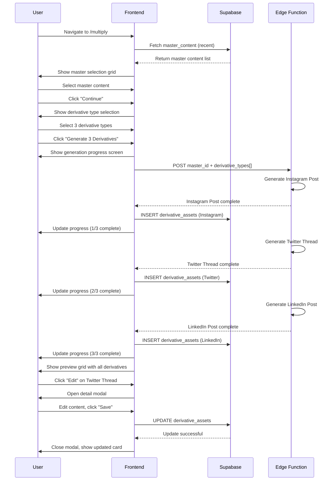

# Workflow 03: Multiply Flow

## Overview & Purpose

The Multiply Flow transforms a single master content piece into multiple platform-specific derivative assets. This workflow allows users to repurpose long-form content into social media posts, emails, graphics, and other formats optimized for different channels.

**Primary Goals**:
- Select master content as source material
- Choose derivative asset types to generate
- Generate multiple derivatives in one batch
- Preview and edit individual derivatives
- Schedule or save derivatives to library

---

## Entry Points

1. **Sidebar Navigation** - "Multiply" menu item
2. **After Content Creation** - "Multiply" button in content editor
3. **Library Actions** - "Multiply" button on content cards
4. **Dashboard** - "Multiply Content" quick action tile

---

## Step-by-Step Screens

### Screen 1: Master Content Selection

**Layout**:
- Header: "Select Content to Multiply"
- Content switcher tabs:
  - "Recent" (last 10 created)
  - "All Master Content" (full library view)
  - "Favorites" (starred items)
- Content grid/list:
  - Each card shows:
    - Title
    - Content type badge
    - Preview text (first 150 chars)
    - Word count
    - Created date
    - "Select" button
- Search bar (top right): Filter by title
- Filter dropdown: By content type, collection

**Visual Details**:
- Cards: Bordered, hoverable, gold border on hover
- Selected card: Highlighted with checkmark overlay
- Empty state: "No master content yet. Create your first piece."
- Badge: Content type (Blog, Email, Product Story)

**User Action**:
- Click card or "Select" → Highlight card
- Click "Continue" (bottom fixed bar) → Proceed to derivative selection
- Only one master content can be selected at a time

---

### Screen 2: Derivative Type Selection

**Layout**:
- Top: Master content summary card
  - Title, type, word count
  - "Change Source" button (back to step 1)
- Main area: Derivative type grid
  - **Social Media** section:
    - Instagram Post (square image + caption)
    - Instagram Story (vertical image + swipe-up text)
    - Twitter Thread (series of connected tweets)
    - LinkedIn Post (professional long-form)
    - Facebook Post (casual, engagement-focused)
  - **Email Marketing** section:
    - Email Newsletter (HTML email)
    - Email Sequence (3-part series)
    - Promotional Email (CTA-focused)
  - **Visual Assets** section:
    - Pinterest Pin (vertical graphic)
    - Blog Header Image (landscape)
    - Quote Graphic (social shareable)
  - **Other Formats** section:
    - Short-Form Blog (500 words)
    - Product Description (e-commerce ready)
    - Script/Outline (video or podcast)

**Visual Details**:
- Derivative cards: Checkbox + icon + name + description
- Multi-select: Checkboxes allow selecting multiple types
- Selected state: Gold border, checkbox checked, accent background
- Platform icons: Instagram, Twitter, LinkedIn logos
- Estimated output: "~280 characters" shown under Twitter

**User Action**:
- Check/uncheck derivatives → Add to generation queue
- Click "Generate X Derivatives" (X = count) → Proceed to generation

---

### Screen 3: Batch Generation

**Layout**:
- Progress indicator: "Generating 5 derivatives..."
- Individual progress cards:
  - Instagram Post: ⏳ Generating...
  - Twitter Thread: ✓ Complete
  - LinkedIn Post: ⏳ Generating...
  - Email Newsletter: ⚠️ Error (retry button)
  - Quote Graphic: ⏳ Generating...
- Overall progress bar: 40% complete
- Background: Subtle animation (particles, shimmer)

**Visual Details**:
- Loader icons: Spinning for in-progress, checkmark for complete
- Error state: Red icon, "Retry" button
- Success state: Green checkmark, fade in
- Staggered animation: Cards appear as they complete

**States**:
- Pending: Gray, waiting icon
- Generating: Gold spinner
- Complete: Green checkmark, preview thumbnail
- Error: Red alert icon, error message

**Duration**: Typically 10-30 seconds for full batch

---

### Screen 4: Derivative Preview Grid

**Layout**:
- Top bar:
  - "All derivatives generated" success message
  - "Save All to Library" button
  - "Schedule All" button (opens batch schedule modal)
- Grid of derivative cards (2-3 columns on desktop):
  - **Card structure**:
    - Platform badge (top left): Instagram, Twitter, etc.
    - Content preview: Text excerpt or image thumbnail
    - Character/word count
    - Quality indicator (stars or percentage)
    - Action buttons:
      - "Edit" (opens detail modal)
      - "Schedule" (opens schedule modal for this item)
      - "Regenerate" (single item)
      - "Delete" (trash icon)

**Visual Details**:
- Cards: Clean, bordered, slight shadow
- Platform badges: Color-coded (Instagram purple, Twitter blue, LinkedIn blue)
- Preview text: Truncated with "..." if long
- Image previews: Aspect ratio preserved
- Hover: Scale 1.02, shadow increase

**Interaction**:
- Click card → Open detail view
- Click "Edit" → Open inline editor
- Click "Schedule" → Open schedule modal (see Workflow 05)

---

### Screen 5: Derivative Detail/Edit Modal

**Layout** (Modal overlay):
- Header:
  - Platform name + icon
  - "Close" button (X)
- Content area:
  - **For text derivatives**:
    - Rich text editor with platform constraints
    - Character/word count (live)
    - Preview toggle: Mobile/desktop view
  - **For image derivatives**:
    - Large image preview
    - "Regenerate with changes" button
    - Download button
- Platform-specific info:
  - Twitter: "Thread of 5 tweets"
  - Instagram: "Includes hashtags: #fragrance #luxury"
  - Email: "Subject: [subject line]"
- Bottom action bar:
  - "Save Changes" (primary)
  - "Schedule" (secondary)
  - "Cancel" (text link)

**Visual Details**:
- Modal: Full screen on mobile, centered 80% width on desktop
- Editor: Clean, distraction-free
- Preview: Shows how content appears on actual platform
- Character limit: Visual indicator (green → yellow → red as approaching limit)

---

## UI Components Breakdown

### Master Content Card
- **Component**: `MasterContentCard` (from amplify folder)
- **Props**: `content`, `onSelect`, `isSelected`
- **Styling**: Hoverable, selectable, preview text

### Derivative Type Grid
- **Component**: Custom grid with checkboxes
- **Structure**:
  ```jsx
  <div className="grid md:grid-cols-2 lg:grid-cols-3 gap-4">
    <Card onClick={toggleSelection}>
      <Checkbox checked={selected} />
      <PlatformIcon />
      <h4>{name}</h4>
      <p>{description}</p>
    </Card>
  </div>
  ```

### Generation Progress Card
- **Component**: Custom card with status
- **States**: Pending, Generating, Complete, Error
- **Features**: Animated transitions, retry button

### Derivative Grid Card
- **Component**: `DerivativeGridCard`
- **Features**:
  - Platform badge
  - Content preview
  - Action buttons (Edit, Schedule, Delete)
  - Quality rating display

### Derivative Detail Modal
- **Component**: `DerivativeFullModal`
- **Features**:
  - Full-screen editor
  - Platform preview toggle
  - Character count
  - Save/schedule actions

---

## State Management

### Selection State
```typescript
const [selectedMasterContent, setSelectedMasterContent] = useState<MasterContent | null>(null)
const [selectedDerivativeTypes, setSelectedDerivativeTypes] = useState<string[]>([])
```

### Generation State
```typescript
const [isGenerating, setIsGenerating] = useState(false)
const [generationProgress, setGenerationProgress] = useState<{
  [key: string]: 'pending' | 'generating' | 'complete' | 'error'
}>({})
const [generatedDerivatives, setGeneratedDerivatives] = useState<DerivativeAsset[]>([])
```

### Database Operations
- **Read**: Fetch master_content for selection
- **Write**: Insert to `derivative_assets` table per generated item
- **Update**: Edit derivative content
- **Delete**: Remove derivative from library

### Edge Function
- **Function**: `repurpose-content`
- **Inputs**: Master content ID + array of derivative types
- **Outputs**: Array of generated derivatives
- **Processing**: Parallel generation, results returned as completed

---

## User Actions & Transitions

### Master Selection → Derivative Selection
- Click "Select" on master content card
- Click "Continue" → `setSelectedMasterContent(content)`
- Slide to derivative type grid

### Derivative Selection → Generation
- Check derivative types (3 selected)
- Click "Generate 3 Derivatives"
- Validate: At least 1 type selected
- Show generation screen
- Call edge function with master ID + types array

### Generation → Preview Grid
- As each derivative completes, add to grid
- When all complete (or max time elapsed), show full grid
- Auto-save all derivatives to database
- Show success message

### Preview Grid → Detail Edit
- Click "Edit" on card → Open modal
- Edit content inline
- Click "Save Changes" → Update derivative in database
- Close modal, return to grid with updated content

### Preview Grid → Schedule
- Click "Schedule" on card → Open schedule modal (Workflow 05)
- Select date/time/platform
- Save scheduled_content record
- Return to grid, card shows "Scheduled" badge

---

## Responsive Behaviors

### Desktop (> 1024px)
- Master content grid: 3 columns
- Derivative type grid: 3 columns
- Preview grid: 3 columns
- Detail modal: 800px width, centered

### Tablet (768px - 1024px)
- Master content grid: 2 columns
- Derivative type grid: 2 columns
- Preview grid: 2 columns
- Detail modal: 90% width

### Mobile (< 768px)
- All grids: Single column
- Detail modal: Full screen
- Sticky action buttons: Bottom of screen
- Scrollable content: Cards stack vertically

---

## Integration Points

### ← Content Creation
- "Multiply" button in content editor
- Passes master content ID directly
- Pre-selects master content in Multiply flow

### ← Library
- "Multiply" action on library items
- Opens Multiply with that content selected
- Returns to library after save

### → Calendar/Scheduling
- "Schedule" button on derivatives
- Opens schedule modal (Workflow 05)
- Creates scheduled_content records

### → Library
- "Save All to Library" saves all derivatives
- Individual derivatives auto-saved on generation
- Derivatives appear in library with "Derivative" badge

### ↔ Madison Assistant
- Can suggest which derivative types to create
- Can review generated derivatives
- Can suggest improvements to specific derivatives

---

## Data Flow Diagram



---

## Design Tokens Reference

### Colors
- Background: `hsl(var(--background))`
- Platform badges:
  - Instagram: `bg-purple-100 text-purple-700`
  - Twitter: `bg-blue-100 text-blue-700`
  - LinkedIn: `bg-blue-100 text-blue-800`
  - Email: `bg-green-100 text-green-700`
- Success state: `bg-green-50 border-green-200`
- Error state: `bg-red-50 border-red-200`

### Typography
- Card titles: `font-cormorant text-xl font-semibold`
- Content preview: `font-lato text-sm text-muted-foreground`
- Character count: `font-mono text-xs`
- Platform name: `font-lato text-sm font-medium`

### Spacing
- Grid gap: `gap-6`
- Card padding: `p-4`
- Modal padding: `p-6`
- Button gap: `gap-2`

### Borders
- Cards: `border border-border rounded-lg`
- Selected card: `border-2 border-primary`
- Platform badge: `rounded-full px-2 py-1`

### Shadows
- Cards: `shadow-sm hover:shadow-md`
- Modal: `shadow-2xl`
- Generating cards: `shadow-lg` (emphasis)

---

## Component Inventory

### From Codebase
1. `MasterContentCard` - Master content selection card
2. `MasterContentSwitcher` - Tabs for Recent/All/Favorites
3. `DerivativeGridCard` - Individual derivative preview card
4. `DerivativeFullModal` - Detail edit modal
5. `DerivativeTypeFolder` - Groups derivatives by type
6. `ScheduleButton` - Schedule action trigger
7. `Input`, `Textarea`, `Button`, `Checkbox` - Base UI components

### Custom Components Needed
- Platform badge with icon
- Character count indicator with color coding
- Batch progress indicator
- Regeneration confirmation dialog
- Bulk action toolbar (select multiple, schedule all)

---

## Known Edge Cases

1. **Master content deleted during generation**: Show error, return to selection
2. **Network timeout during batch**: Save partial results, show which failed, allow retry
3. **User closes tab during generation**: Derivatives saved to database, user can resume viewing
4. **No master content exists**: Show empty state, CTA to create content
5. **Derivative generation fails for one type**: Show error on that card, others succeed
6. **User edits derivative during regeneration**: Queue edits, apply after regeneration
7. **Platform constraints changed**: Warn user if content exceeds new limits
8. **Simultaneous edits** (team): Last save wins, show conflict warning
