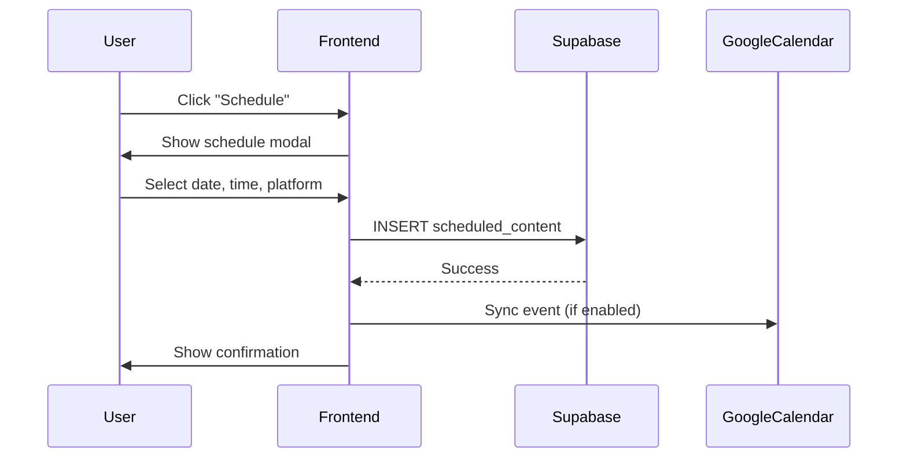

# Workflow 05: Calendar/Scheduling Flow

## Overview & Purpose

The Calendar allows users to schedule content for publication, view scheduled items, sync with Google Calendar, and manage their content calendar.

**Primary Goals**:
- View scheduled content by month/week/agenda
- Schedule new content items
- Edit/reschedule existing items
- Sync with Google Calendar
- Add notes and tasks

---

## Entry Points

1. **Sidebar Navigation** - "Calendar" menu item
2. **Schedule buttons** - From Library or Multiply
3. **Dashboard** - "View Calendar" quick action

---

## Key Screens

### Calendar Views
- **Month View**: Grid with scheduled items as dots/cards
- **Week View**: Time slots with scheduled content
- **Agenda View**: List of upcoming scheduled items
- **Header**: View switcher, date navigation, "Add Content" button

### Schedule Modal
- **Fields**: 
  - Content selection (if not pre-selected)
  - Date picker
  - Time picker
  - Platform dropdown (Instagram, Twitter, LinkedIn, etc.)
  - Notes textarea
- **Actions**: "Schedule", "Cancel"
- **Conflict detection**: Warns if time slot already occupied

### Calendar Sidebar
- **Tasks list**: To-dos with checkboxes
- **Notes panel**: Daily notes textarea
- **Google Calendar toggle**: Enable/disable sync
- **Platform filters**: Show/hide by platform

---

## Components

- `MonthView` - Month calendar grid
- `WeekView` - Week timeline
- `AgendaView` - List view
- `ScheduleModal` - Scheduling dialog
- `CalendarSidebar` - Tasks and notes
- `GoogleCalendarConnect` - OAuth connection

---

## Data Flow

---

## Design Tokens

- Calendar grid: `border-border`
- Scheduled item: `bg-primary/20 text-primary-foreground`
- Today highlight: `bg-accent border-accent`
- Past dates: `text-muted-foreground opacity-50`
