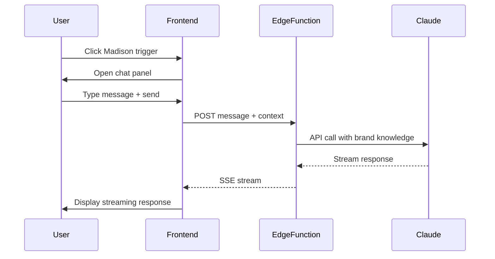

# Workflow 06: Madison Assistant Flow

## Overview & Purpose

Madison is the AI editorial director that provides guidance, suggestions, and answers questions about content and brand strategy.

**Primary Goals**:
- Provide editorial guidance
- Answer brand questions
- Suggest content ideas
- Review content quality
- Offer strategic insights

---

## Entry Points

1. **Floating trigger button** - Bottom right corner (global)
2. **Contextual triggers** - In content editor, library
3. **Dashboard** - "Ask Madison" quick action

---

## Key Screens

### Chat Panel
- **Layout**: Slide-in panel from right (desktop) or bottom sheet (mobile)
- **Header**: "Madison - Editorial Director", close button
- **Messages**: Chat bubbles (user right, Madison left)
- **Input**: Message textarea with "Think Mode" toggle
- **Features**: 
  - Streaming responses
  - Conversation history
  - Context awareness (current page, selected content)
  - Quick actions (suggest, review, brainstorm)

### Think Mode
- **Activation**: Toggle in input area
- **Visual**: Different color scheme, "deep thinking" indicator
- **Behavior**: More detailed, strategic responses

---

## Components

- `EditorialAssistantPanel` - Main chat panel
- `AssistantTrigger` - Floating button
- `MadisonPanel` - Chat interface (in prompt library)
- Message bubbles with markdown rendering
- Streaming response indicator

---

## Data Flow

---

## Design Tokens

- Panel: `bg-background border-l border-border shadow-2xl`
- User message: `bg-primary text-primary-foreground`
- Madison message: `bg-muted`
- Think mode: `bg-accent/10 border-accent`
