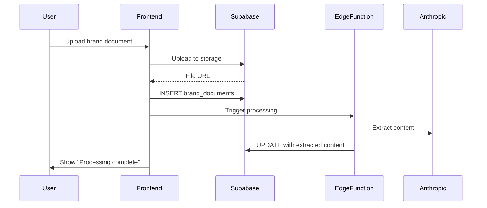

# Workflow 07: Settings/Configuration Flow

## Overview & Purpose

Settings is where users manage brand identity, products, team members, collections, and integrations.

**Primary Goals**:
- Upload/manage brand documents
- Add/edit products
- Manage team members
- Configure collections
- Connect integrations (Google Calendar)
- Update brand configuration

---

## Entry Points

1. **Sidebar Navigation** - "Settings" menu item (gear icon)
2. **Onboarding** - Post-onboarding redirect
3. **Banner prompts** - "Complete your brand setup"

---

## Key Screens

### Settings Tabs
1. **Brand Guidelines**: Upload documents, view processing status, brand color/industry
2. **Products**: CSV import, manual add, product grid, edit/delete
3. **Collections**: Create/edit/delete collections, set color themes
4. **Team**: Invite members, manage roles (owner/admin/member), remove users
5. **Integrations**: Google Calendar OAuth, API connections
6. **Madison Training** (super admin only): Upload training documents

### Brand Guidelines Tab
- **Document upload**: Drag-drop zone
- **Document list**: File name, status, processing stage, delete button
- **Brand config**: Color picker, industry selector, save button

### Products Tab
- **Import CSV**: Upload button, template download
- **Manual add**: Form with product fields (name, category, scent profile, etc.)
- **Product grid**: Cards with edit/delete actions
- **Bulk actions**: Select multiple, delete

### Collections Tab
- **Collection list**: Name, description, color theme, sort order
- **Create new**: Modal with name, description, transparency statement, color
- **Edit/delete**: Inline actions

---

## Components

- `BrandGuidelinesTab` - Brand documents management
- `ProductsTab` - Product catalog
- `CollectionsTab` - Collection management
- `TeamTab` - Team member management
- `BrandDocumentStatus` - Upload status indicators
- `IndustrySelector` - Industry dropdown

---

## Data Flow

---

## Design Tokens

- Tab navigation: `border-b border-border`
- Active tab: `border-b-2 border-primary text-primary`
- Upload zone: `border-2 border-dashed hover:border-solid`
- Product cards: `border rounded-lg p-4`
