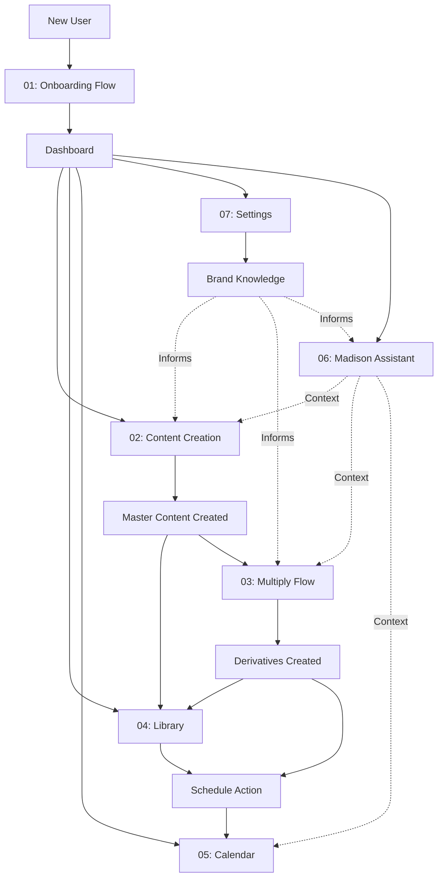

# Madison Workflow Index for Polymet

This document provides an overview of all Madison workflows, their connections, and how they integrate to form the complete user experience.

## Workflow Map

## Workflow Overview

### 01: Onboarding Flow
**Purpose**: First-time user setup  
**Entry**: App launch (new user)  
**Exit**: Dashboard  
**Key Outputs**: Organization created, brand identity set, optional brand document uploaded

### 02: Content Creation Flow (The Forge)
**Purpose**: Generate master content using AI  
**Entry**: Dashboard CTA, Sidebar "Create" link  
**Exit**: Library (saved content) or Multiply (generate derivatives)  
**Key Outputs**: Master content (blog post, email, product story, etc.)

### 03: Multiply Flow
**Purpose**: Generate multiple derivative assets from master content  
**Entry**: Multiply page, Library item action  
**Exit**: Library (saved derivatives) or Calendar (schedule derivatives)  
**Key Outputs**: Derivative assets (Instagram posts, Twitter threads, emails, etc.)

### 04: Library/Archives Flow
**Purpose**: Browse, search, and manage all content  
**Entry**: Sidebar "Library" link, Post-creation save  
**Exit**: Content detail modal, Schedule modal, Multiply flow  
**Key Outputs**: Content organization, scheduled content

### 05: Calendar/Scheduling Flow
**Purpose**: Schedule content for publication  
**Entry**: Library schedule button, Multiply schedule button, Direct calendar add  
**Exit**: Calendar view with scheduled items  
**Key Outputs**: Scheduled content entries, Google Calendar sync

### 06: Madison Assistant Flow
**Purpose**: AI editorial director for guidance and suggestions  
**Entry**: Floating trigger button (global)  
**Exit**: Panel closes, user continues workflow  
**Key Outputs**: Editorial guidance, content suggestions, brand insights

### 07: Settings/Configuration Flow
**Purpose**: Manage brand, products, team, and integrations  
**Entry**: Sidebar "Settings" link  
**Exit**: Return to previous view  
**Key Outputs**: Updated brand knowledge, product catalog, team members, integrations

---

## Critical User Journeys

### Journey 1: First-Time User to First Content
1. **Onboarding** → Set brand identity
2. **Settings** → Upload brand documents (optional)
3. **Content Creation** → Generate first blog post
4. **Library** → Review and edit
5. **Calendar** → Schedule for publication

### Journey 2: Power User - Master to Multi-Platform
1. **Content Creation** → Write comprehensive blog post
2. **Multiply** → Generate Instagram, Twitter, LinkedIn, Email versions
3. **Review Derivatives** → Edit individual pieces
4. **Bulk Schedule** → Schedule across platforms via calendar

### Journey 3: Quick Schedule from Library
1. **Library** → Browse existing content
2. **Search/Filter** → Find specific piece
3. **Detail Modal** → Review content
4. **Schedule Button** → Open schedule modal
5. **Calendar** → Confirm scheduled

### Journey 4: Brand Knowledge Update Cycle
1. **Settings** → Upload new brand document
2. **Processing** → Document absorbed into knowledge base
3. **Content Creation** → New content reflects updated brand voice
4. **Madison Assistant** → Can answer questions about new document

---

## Integration Points

### Data Flow Between Workflows

| From Workflow | To Workflow | Data Passed | Trigger |
|---------------|-------------|-------------|---------|
| Onboarding | Settings | Organization ID, Brand Config | Auto-redirect |
| Content Creation | Library | Master Content ID, Full Content | Save action |
| Content Creation | Multiply | Master Content ID | "Multiply" button |
| Multiply | Library | Derivative Asset IDs | Auto-save |
| Library | Calendar | Content ID, Title, Type | Schedule button |
| Settings | Content Creation | Brand Knowledge | Context injection |
| Madison | Any | Editorial guidance | User query |

### Shared Components Across Workflows

- **ScheduleButton**: Used in Library, Multiply
- **ContentCard**: Used in Library, Multiply
- **ProductSelector**: Used in Content Creation, Settings
- **BrandDocumentUpload**: Used in Onboarding, Settings
- **MadisonPanel**: Global assistant panel

---

## Workflow Dependencies

### Required Before Use
- **Onboarding**: None (first-run)
- **Content Creation**: Organization exists (from onboarding)
- **Multiply**: Master content exists (from creation or library)
- **Library**: At least one content piece created
- **Calendar**: Scheduled content exists
- **Madison**: Brand knowledge uploaded (for best results)
- **Settings**: Organization exists

### Optional Enhancements
- **Google Calendar Sync**: Requires OAuth in Settings
- **Product Selection**: Requires products added in Settings
- **Collection Filtering**: Requires collections defined in Settings

---

## Design System Consistency

All workflows use shared design tokens from `index.css` and `tailwind.config.ts`:

### Colors
- Primary: `hsl(var(--primary))` - Aged brass/gold
- Background: `hsl(var(--background))` - Parchment/cream
- Text: `hsl(var(--foreground))` - Ink black
- Accent: `hsl(var(--accent))` - Charcoal

### Typography
- Headings: `font-cormorant` (Cormorant Garamond)
- Body: `font-lato` (Lato)

### Spacing
- Consistent padding: `p-6`, `p-4`, `p-2`
- Gap utilities: `gap-4`, `gap-6`

---

## Responsive Breakpoints

All workflows adapt at these breakpoints:
- **Mobile**: < 768px (single column, bottom sheets)
- **Tablet**: 768px - 1024px (sidebar collapses, adjusted grids)
- **Desktop**: > 1024px (full sidebar, multi-column layouts)

---

## Document References

- [01: Onboarding Flow](./POLYMET_WORKFLOW_01_ONBOARDING.md)
- [02: Content Creation Flow](./POLYMET_WORKFLOW_02_CONTENT_CREATION.md)
- [03: Multiply Flow](./POLYMET_WORKFLOW_03_MULTIPLY.md)
- [04: Library Flow](./POLYMET_WORKFLOW_04_LIBRARY.md)
- [05: Calendar/Scheduling Flow](./POLYMET_WORKFLOW_05_CALENDAR.md)
- [06: Madison Assistant Flow](./POLYMET_WORKFLOW_06_MADISON.md)
- [07: Settings/Configuration Flow](./POLYMET_WORKFLOW_07_SETTINGS.md)

---

## Usage in Polymet

Each workflow document can be used independently to create UI mockups. Designers should:

1. Start with the workflow most relevant to their current task
2. Reference the **UI Components Breakdown** section for detailed screen layouts
3. Use the **Design Tokens Reference** to maintain visual consistency
4. Refer to the **Data Flow Diagram** to understand state changes
5. Check this index for integration points with other workflows

The modular structure allows parallel design work across different workflows without requiring full system context.
