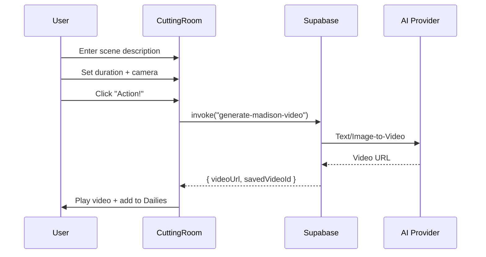

# The Cutting Room - Video Generation PRD

> **Product Requirements Document**
> Madison Studio - AI Video Production Suite
> Created: 2026-01-22

---

## 1. Vision

**The Cutting Room** is Madison Studio's AI-powered video generation interface, designed as a sibling to the Dark Room (image generation). It transforms text prompts, scripts from Multiply, and static images into dynamic video content for social media, product showcases, and brand storytelling.

### Naming Rationale
- **Dark Room** → Photography developing metaphor → Images
- **Cutting Room** → Film editing metaphor → Video
- Together they form the **Visual Production Suite**

---

## 2. Strategic Decision: Merge vs. Separate

### Recommendation: **Unified System with Distinct Modes**

After analyzing the Dark Room codebase, I recommend:

```
/studio (new route)
├── Mode Toggle: [📷 Photo] | [🎬 Video]
├── Shared: Header, Product Selection, Asset Library
└── Distinct: Center Canvas (Image Grid vs Video Player)
```

**Why Merge:**
| Benefit | Explanation |
|---------|-------------|
| **Shared Context** | Same product, brand, organization |
| **Asset Pipeline** | Dark Room images → Cutting Room animation |
| **Code Reuse** | 60% of components shared (Header, LeftRail, Presets) |
| **Mental Model** | Like switching Photo/Video mode on a camera |

**Implementation Path:**
1. Create `pages/Studio.tsx` as shell
2. Render `<DarkRoomView />` or `<CuttingRoomView />` based on mode
3. Share `StudioHeader`, `ProductSelector`, `ProSettings`

---

## 3. User Stories

### Primary Flows

1. **Script-to-Video** (Multiply Integration)
   > As a marketer, I want to take the video scripts generated in Multiply and turn them into actual video content.

2. **Image-to-Video** (Dark Room Integration)
   > As a content creator, I want to animate my Dark Room product shots with subtle motion.

3. **Text-to-Video** (Direct)
   > As a brand manager, I want to describe a scene and generate a video from scratch.

### Secondary Flows

4. **Product Showcase Loop**
   > Generate a 5-second looping video of a product rotating on a marble surface.

5. **Social Reel Generation**
   > Create a 9:16 vertical video optimized for Instagram/TikTok.

---

## 4. Design System (Dark Room Inheritance)

### Aesthetic Adaptation

| Dark Room Element | Cutting Room Equivalent |
|-------------------|------------------------|
| Shutter Sound | Clapperboard "Slate" Sound |
| Flash Overlay | Film Grain Transition |
| LED Indicator | REC Light (Red Pulse) |
| "Capture" Button | "Action!" Button |
| Hero Image | Hero Cut (Featured Video) |
| Image Grid | Dailies Reel (Video Thumbnails) |
| Light Table | Screening Room |

### CSS Variables (Extend `darkroom.css`)

```css
/* Add to src/styles/cuttingroom.css */
:root {
  /* Inherits all --darkroom-* variables */

  /* Video-specific accents */
  --cuttingroom-rec: #ff3b30;
  --cuttingroom-timeline: rgba(196, 160, 82, 0.3);
  --cuttingroom-playhead: var(--aged-brass);
}
```

### Layout (3-Column, Adapted)

```
┌─────────────────────────────────────────────────────────────┐
│  [← Back] [✕ Exit]  THE CUTTING ROOM    [🔴 REC] [💾 Save] │
├──────────────┬─────────────────────────────┬────────────────┤
│              │                             │                │
│  CONTROL     │       MONITOR              │   ASSET        │
│  BOARD       │   ┌─────────────────┐      │   RACK         │
│              │   │                 │      │                │
│  □ Script    │   │   Video Player  │      │  Presets       │
│  □ Duration  │   │   + Progress    │      │  History       │
│  □ Camera    │   │                 │      │  Scenes        │
│  □ Style     │   └─────────────────┘      │  Audio         │
│              │   |▶ ─────●──────── |      │                │
│  [ACTION!]   │   Dailies Strip           │  Pro Mode      │
│              │                             │                │
└──────────────┴─────────────────────────────┴────────────────┘
```

---

## 5. Functional Requirements

### 5.1 Control Board (Left Rail)

| Control | Type | Description |
|---------|------|-------------|
| **Script Input** | Textarea | Scene description or imported Multiply script |
| **Duration** | Select | 3s / 5s / 10s / 15s |
| **Aspect Ratio** | Toggle | 16:9 (Landscape) / 9:16 (Portrait) / 1:1 (Square) |
| **Camera Motion** | Select | Static / Pan Left / Pan Right / Zoom In / Zoom Out / Orbit |
| **Subject Image** | Upload | Static image to animate (from Dark Room or upload) |
| **Style Reference** | Upload | Video or image for style matching |

### 5.2 Monitor (Center Canvas)

| Element | Description |
|---------|-------------|
| **Video Player** | HTML5 video with custom controls |
| **Progress Bar** | Playhead with timestamp |
| **Dailies Strip** | Horizontal scroll of generated videos (thumbnails) |
| **Empty State** | "Describe your scene to begin" |
| **Loading State** | "Rendering..." with progress indicator |

### 5.3 Asset Rack (Right Panel)

| Section | Content |
|---------|---------|
| **Quick Presets** | Cinematic, Product Spin, Social Reel, Ambient |
| **Scenes Library** | Previously generated videos |
| **Audio** | Background music/SFX (future phase) |
| **Pro Mode** | AI Provider, Quality (HD/4K), FPS |

### 5.4 Generation Flow



---

## 6. Integration Points

### 6.1 From Multiply (Script Ingestion)

```typescript
// In Multiply.tsx VideoScriptResults
const handleSendToCuttingRoom = (script: VideoScript) => {
  navigate("/studio", {
    state: {
      mode: "video",
      script: script.prompt,
      duration: script.duration,
      cameraMovement: script.cameraMovement,
    }
  });
};
```

### 6.2 From Dark Room (Image Animation)

```typescript
// In DarkRoom.tsx
const handleAnimateImage = (image: GeneratedImage) => {
  navigate("/studio", {
    state: {
      mode: "video",
      subjectImage: image.imageUrl,
      prompt: `Subtle motion: ${image.prompt}`,
    }
  });
};
```

### 6.3 Backend Edge Function

```typescript
// supabase/functions/generate-madison-video/index.ts
interface VideoGenerationRequest {
  prompt: string;
  userId: string;
  organizationId: string;
  duration: "3s" | "5s" | "10s" | "15s";
  aspectRatio: "16:9" | "9:16" | "1:1";
  cameraMotion?: string;
  subjectImageUrl?: string;
  styleReferenceUrl?: string;
  aiProvider?: "runway" | "luma" | "pika" | "auto";
  quality?: "standard" | "hd" | "4k";
}

interface VideoGenerationResponse {
  videoUrl: string;
  savedVideoId: string;
  thumbnailUrl: string;
  duration: number;
  credits_used: number;
}
```

---

## 7. Technical Architecture

### 7.1 New Files

```
src/
├── pages/
│   └── Studio.tsx              # Unified shell (replaces separate routes)
├── components/
│   └── cuttingroom/
│       ├── index.ts            # Exports
│       ├── CuttingRoomView.tsx # Main video interface
│       ├── VideoPlayer.tsx     # Custom player with controls
│       ├── DailiesStrip.tsx    # Horizontal video strip
│       ├── ControlBoard.tsx    # Left rail (script, duration, camera)
│       ├── AssetRack.tsx       # Right panel (presets, history)
│       └── RecIndicator.tsx    # Red recording light component
├── styles/
│   └── cuttingroom.css         # Video-specific styles
└── hooks/
    └── useClapperFeedback.ts   # Sound + visual feedback
```

### 7.2 Shared Components (Reuse from Dark Room)

- `StudioHeader` (rename from `DarkRoomHeader`)
- `ProductSelector`
- `ProModeSettings`
- `LEDIndicator` → extends to support "rec" state

### 7.3 Database Schema (Supabase)

```sql
-- Extend existing generated_images table or create parallel
CREATE TABLE generated_videos (
  id UUID PRIMARY KEY DEFAULT uuid_generate_v4(),
  user_id UUID REFERENCES auth.users(id),
  organization_id UUID REFERENCES organizations(id),
  prompt TEXT NOT NULL,
  video_url TEXT NOT NULL,
  thumbnail_url TEXT,
  duration INTEGER, -- seconds
  aspect_ratio TEXT,
  camera_motion TEXT,
  ai_provider TEXT,
  credits_used INTEGER DEFAULT 1,
  metadata JSONB,
  created_at TIMESTAMPTZ DEFAULT NOW()
);
```

---

## 8. UX Nuances (Madison Touch)

| Feature | Implementation |
|---------|----------------|
| **"Action!" Button** | Brass accent, triggers clapperboard sound |
| **REC Light** | Pulses red during generation |
| **Film Grain** | Subtle overlay during transitions |
| **Clapperboard Sound** | `useClapperFeedback()` hook |
| **Dailies** | Film-strip aesthetic for video history |

### Sound Design
```typescript
// src/hooks/useClapperFeedback.ts
export function useClapperFeedback() {
  const audioRef = useRef<HTMLAudioElement | null>(null);

  const trigger = useCallback(() => {
    if (!audioRef.current) {
      audioRef.current = new Audio("/sounds/clapper.mp3");
    }
    audioRef.current.currentTime = 0;
    audioRef.current.play();
  }, []);

  return { trigger };
}
```

---

## 9. Phased Rollout

### Phase 1: Foundation (Week 1-2)
- [ ] Create `/studio` route with mode toggle
- [ ] Implement `CuttingRoomView` with basic layout
- [ ] Text-to-video generation (single provider)
- [ ] Video player with basic controls
- [ ] Dailies strip

### Phase 2: Integration (Week 3)
- [ ] Multiply → Cutting Room script handoff
- [ ] Dark Room → Cutting Room image animation
- [ ] Duration & aspect ratio controls
- [ ] Camera motion presets

### Phase 3: Polish (Week 4)
- [ ] Clapperboard sound feedback
- [ ] REC indicator animation
- [ ] Pro Mode (provider selection, quality)
- [ ] Video library/vault

### Phase 4: Advanced (Future)
- [ ] Multi-clip timeline
- [ ] Audio overlay
- [ ] Batch generation
- [ ] Direct social publishing

---

## 10. Success Metrics

| Metric | Target |
|--------|--------|
| Time to first video | < 60 seconds |
| Generation success rate | > 95% |
| User satisfaction (NPS) | > 50 |
| Videos generated per session | 3+ |
| Multiply → Cutting Room conversion | > 30% |

---

## 11. Open Questions

1. **AI Provider Selection**: Runway vs. Luma vs. Pika? Support multiple?
2. **Credit System**: How many credits per video? Duration-based?
3. **Storage**: Video CDN strategy? (Cloudflare Stream, Mux, etc.)
4. **Audio**: Include background music in Phase 1 or defer?

---

## 12. Appendix: Dark Room Code References

Key files analyzed for consistency:
- `src/pages/DarkRoom.tsx` - Main interface structure
- `src/components/darkroom/DarkRoomHeader.tsx` - Header pattern
- `src/components/multiply/VideoScriptResults.tsx` - Script data structure
- `src/styles/darkroom.css` - CSS custom properties

---

*Document authored by Madison Studio Engineering*
